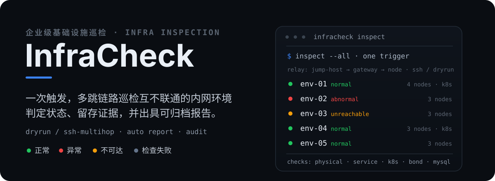
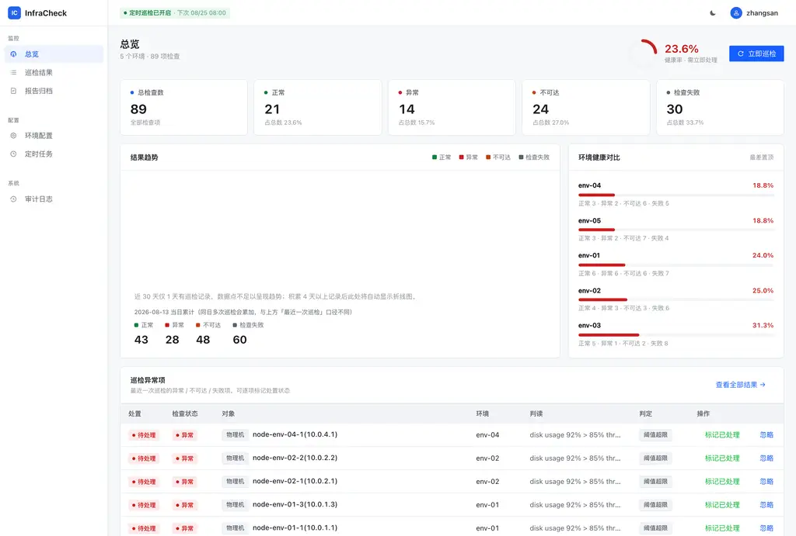

<p align="center">
  
</p>

InfraCheck 是一个企业级运维巡检平台：通过跳板机一次触发，巡检**多个网络互不连通**的内网部署环境，对每类对象自动判定状态、记录证据，并产出可浏览、可归档的巡检报告。

平台覆盖**环境 / 集群 / 物理机 / 系统服务 / Pod** 五类对象，任何一次巡检的每条结果都判断为四种状态之一：`正常`、`异常`、`不可达`、`检查失败`——三者的运维含义不同，处置方式也不同。

无外部依赖，开箱即用：默认 `dryrun` 数据源启动即自动播种 5 套环境的演示数据，克隆仓库跑起来，马上看到端到端效果。

---

## 演示

真实健康大盘（5 个环境 · 89 项检查 · 四态判定 · 环境健康对比 · 带证据的异常项列表）：

<p align="center">
  
</p>

## 它解决了什么

企业通常有多个**彼此网络互不连通**的部署环境（生产、内网隔离区等），传统巡检需要逐个环境登录、手工执行命令、人工比对结果。InfraCheck 只依赖一台能同时访问全部环境网络的**跳板机**，由平台经它触达所有目标：

- **一次触发，全量覆盖**——按需或定时触发，跨环境统一执行，无需逐台登录。
- **判定带证据**——每条结果都携带原始证据（命令输出、返回码、指标值、日志片段），可追溯、可复盘。
- **结果四态明确**——`正常` / `异常` / `不可达` / `检查失败` 语义严格区分，异常项在异常表逐条处置，处置状态持续跟踪。
- **报告自动归档**——每次巡检自动生成 HTML（平台内浏览）与 Markdown（归档/进仓库）双格式报告。
- **全流程可审计**——谁在何时触发了哪次巡检、哪个报告由哪个账号生成，均有审计日志。

## 核心机制

| 维度 | 说明 |
|------|------|
| 对象模型 | 环境 →（集群 / 物理机 / 系统服务），集群 → 命名空间 → Pod |
| 触达方式 | `ssh` 经跳板机 **ProxyJump** 真连目标；`dryrun` 本地确定性假数据，便于演示与测试 |
| 服务探测 | 按 `probe_mode` 二次分派：`systemd`（systemctl）· `port`（监听端口证明对外可用）· `vip`（VIP 地址是否绑定本机） |
| 结果状态 | 正常 / 异常 / 不可达 / 检查失败 |
| 报告 | HTML + Markdown 双格式，随巡检自动生成 |
| 审计 | 巡检触发与报告生成的完整操作记录 |

`vip` 探测语义值得注意：keepalived 等服务**进程存活不等于正常**——VIP 未绑定本机同样是故障，因此探测的是地址绑定而非进程。

## 快速开始

用 Docker Compose 一键起前后端（默认 `dryrun`，含演示数据）：

```bash
docker compose up -d
# 前端  http://localhost:8080
# 后端  http://localhost:8000
```

在登录页输入任意账号即可（`AUTH_MODE=mock`）。进入大盘后点「立即巡检」，即可看到一次全量巡检的结果与报告。

针对真实环境的巡检，在 `docker-compose.yml` 中切换数据源与透传方式：

```yaml
RUNNER_TRANSPORT: ssh          # dryrun(默认) → ssh 真连
JUMP_HOST: your-jump-host      # 跳板机（唯一能访问全部环境的节点）
JUMP_USER: root
JUMP_KEY: /run/secrets/jump_key
SSH_USER: root
# 生产存储 DATABASE_URL 改用 PostgreSQL
```

### 本地开发

```bash
# 后端（Python 3.12）
cd backend && uv sync
SCHEDULER_ENABLED=false uv run uvicorn app.main:app --port 8000

# 前端（React + Vite，dev 代理 /api → 8000）
cd frontend && npm install && npm run dev
```

## 技术栈

| 层 | 技术 |
|----|------|
| 后端 | Python 3.12 · FastAPI · SQLAlchemy 2.0 · Pydantic v2 · JWT · APScheduler · asyncssh |
| 前端 | React 18 · TypeScript · Vite · Arco Design |
| 部署 | Docker Compose · SQLite（开发）/ PostgreSQL（生产） |

## 结构

```
backend/   FastAPI：models / api / engine / runner / reports / auth / scheduler / seed
frontend/  React：登录 · 健康大盘 · 巡检结果 · 报告 · 配置 · 审计
design-system/infracheck/   设计令牌与组件规范
```

前端页面：`/login` 登录，`/` 健康大盘，`/results` 结果浏览，`/reports` 报告归档，`/configuration` 配置，`/audit` 审计日志。

## 文档

- [`CONTRACT.md`](./CONTRACT.md)——前后端契约的唯一事实来源（数据模型 / REST API / 契约锚点）
- [`CONTEXT.md`](./CONTEXT.md)——领域词汇表，避免歧义
- [`design-system/infracheck/MASTER.md`](./design-system/infracheck/MASTER.md)——设计令牌与交互规范
- [`backend/SMOKE.md`](./backend/SMOKE.md)——后端端到端冒烟测试记录
- [`docs/adr/`](./docs/adr/)——架构决策记录

## 项目状态

面向企业内部使用，尚未公开发布。核心闭环（巡检执行 → 结果判定 → 报告归档 → 审计）已端到端跑通并通过冒烟测试。
